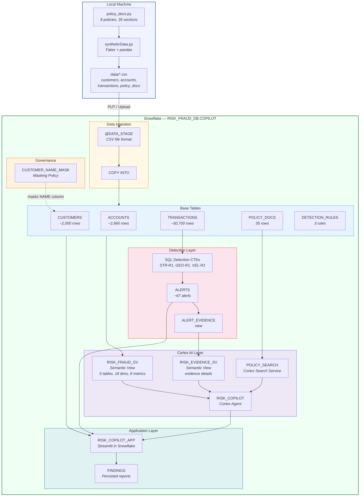
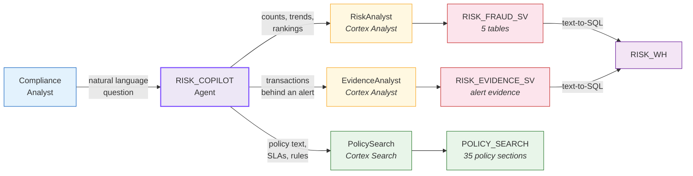
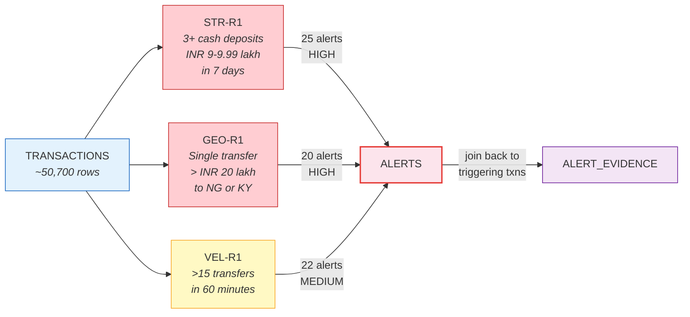
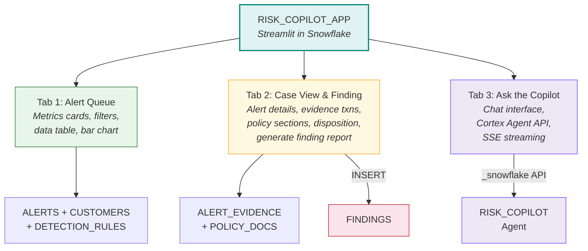

# Architecture Diagrams

## High-Level Architecture

```mermaid
flowchart TB
    subgraph LOCAL["Local Machine"]
        PY["syntheticData.py<br/><i>Faker + pandas</i>"]
        POL["policy_docs.py<br/><i>8 policies, 35 sections</i>"]
        CSV["data/*.csv<br/><i>customers, accounts,<br/>transactions, policy_docs</i>"]
        POL --> PY
        PY --> CSV
    end

    subgraph SF["Snowflake &mdash; RISK_FRAUD_DB.COPILOT"]
        direction TB

        subgraph INGEST["Data Ingestion"]
            STG["@DATA_STAGE<br/><i>CSV file format</i>"]
            COPY["COPY INTO"]
            STG --> COPY
        end

        subgraph TABLES["Base Tables"]
            CUST["CUSTOMERS<br/><i>~2,000 rows</i>"]
            ACCT["ACCOUNTS<br/><i>~2,660 rows</i>"]
            TXN["TRANSACTIONS<br/><i>~50,700 rows</i>"]
            PDOC["POLICY_DOCS<br/><i>35 rows</i>"]
            RULES["DETECTION_RULES<br/><i>3 rules</i>"]
        end

        subgraph DETECT["Detection Layer"]
            SQL_DET["SQL Detection CTEs<br/><i>STR-R1, GEO-R1, VEL-R1</i>"]
            ALERTS["ALERTS<br/><i>~67 alerts</i>"]
            EVID["ALERT_EVIDENCE<br/><i>view</i>"]
            SQL_DET --> ALERTS
            ALERTS --> EVID
        end

        subgraph CORTEX["Cortex AI Layer"]
            SV1["RISK_FRAUD_SV<br/><i>Semantic View<br/>5 tables, 18 dims, 8 metrics</i>"]
            SV2["RISK_EVIDENCE_SV<br/><i>Semantic View<br/>evidence details</i>"]
            CS["POLICY_SEARCH<br/><i>Cortex Search Service</i>"]
            AGENT["RISK_COPILOT<br/><i>Cortex Agent</i>"]
            SV1 --> AGENT
            SV2 --> AGENT
            CS --> AGENT
        end

        subgraph GOV["Governance"]
            MASK["CUSTOMER_NAME_MASK<br/><i>Masking Policy</i>"]
        end

        subgraph APP["Application Layer"]
            SIS["RISK_COPILOT_APP<br/><i>Streamlit in Snowflake</i>"]
            FIND["FINDINGS<br/><i>Persisted reports</i>"]
            SIS --> FIND
        end

        COPY --> TABLES
        TXN --> SQL_DET
        TABLES --> SV1
        EVID --> SV2
        PDOC --> CS
        MASK -.->|"masks NAME column"| CUST
        AGENT --> SIS
        TABLES --> SIS
        ALERTS --> SIS
    end

    CSV -->|"PUT / Upload"| STG

    style LOCAL fill:#f0f4ff,stroke:#4a6fa5,stroke-width:2px
    style SF fill:#f0fff4,stroke:#2d8a4e,stroke-width:2px
    style INGEST fill:#fff8e6,stroke:#c49a00
    style TABLES fill:#e8f4fd,stroke:#2196F3
    style DETECT fill:#fce4ec,stroke:#e53935
    style CORTEX fill:#ede7f6,stroke:#7c4dff
    style GOV fill:#fff3e0,stroke:#ef6c00
    style APP fill:#e0f2f1,stroke:#00897b
```

## Agent Tool Routing

```mermaid
flowchart LR
    USER["Compliance<br/>Analyst"] -->|"natural language<br/>question"| AGENT["RISK_COPILOT<br/>Agent"]

    AGENT -->|"counts, trends,<br/>rankings"| RA["RiskAnalyst<br/><i>Cortex Analyst</i>"]
    AGENT -->|"transactions<br/>behind an alert"| EA["EvidenceAnalyst<br/><i>Cortex Analyst</i>"]
    AGENT -->|"policy text,<br/>SLAs, rules"| PS["PolicySearch<br/><i>Cortex Search</i>"]

    RA --> SV1["RISK_FRAUD_SV<br/><i>5 tables</i>"]
    EA --> SV2["RISK_EVIDENCE_SV<br/><i>alert evidence</i>"]
    PS --> CS["POLICY_SEARCH<br/><i>35 policy sections</i>"]

    SV1 -->|"text-to-SQL"| WH["RISK_WH"]
    SV2 -->|"text-to-SQL"| WH

    style USER fill:#e3f2fd,stroke:#1565c0
    style AGENT fill:#ede7f6,stroke:#7c4dff,stroke-width:2px
    style RA fill:#fff8e1,stroke:#f9a825
    style EA fill:#fff8e1,stroke:#f9a825
    style PS fill:#e8f5e9,stroke:#2e7d32
    style SV1 fill:#fce4ec,stroke:#c62828
    style SV2 fill:#fce4ec,stroke:#c62828
    style CS fill:#e8f5e9,stroke:#2e7d32
    style WH fill:#f3e5f5,stroke:#6a1b9a
```

## Detection Rules Flow

```mermaid
flowchart LR
    TXN["TRANSACTIONS<br/><i>~50,700 rows</i>"]

    TXN --> STR["STR-R1<br/><i>3+ cash deposits<br/>INR 9-9.99 lakh<br/>in 7 days</i>"]
    TXN --> GEO["GEO-R1<br/><i>Single transfer<br/>&gt; INR 20 lakh<br/>to NG or KY</i>"]
    TXN --> VEL["VEL-R1<br/><i>&gt;15 transfers<br/>in 60 minutes</i>"]

    STR -->|"25 alerts<br/>HIGH"| ALERTS["ALERTS"]
    GEO -->|"20 alerts<br/>HIGH"| ALERTS
    VEL -->|"22 alerts<br/>MEDIUM"| ALERTS

    ALERTS -->|"join back to<br/>triggering txns"| EVID["ALERT_EVIDENCE"]

    style TXN fill:#e3f2fd,stroke:#1565c0
    style STR fill:#ffcdd2,stroke:#c62828
    style GEO fill:#ffcdd2,stroke:#c62828
    style VEL fill:#fff9c4,stroke:#f9a825
    style ALERTS fill:#fce4ec,stroke:#e53935,stroke-width:2px
    style EVID fill:#f3e5f5,stroke:#6a1b9a
```

## Streamlit App Tabs

```mermaid
flowchart TB
    APP["RISK_COPILOT_APP<br/><i>Streamlit in Snowflake</i>"]

    APP --> T1["Tab 1: Alert Queue<br/><i>Metrics cards, filters,<br/>data table, bar chart</i>"]
    APP --> T2["Tab 2: Case View & Finding<br/><i>Alert details, evidence txns,<br/>policy sections, disposition,<br/>generate finding report</i>"]
    APP --> T3["Tab 3: Ask the Copilot<br/><i>Chat interface,<br/>Cortex Agent API,<br/>SSE streaming</i>"]

    T1 --> ALERTS["ALERTS + CUSTOMERS<br/>+ DETECTION_RULES"]
    T2 --> EVID["ALERT_EVIDENCE<br/>+ POLICY_DOCS"]
    T2 -->|"INSERT"| FIND["FINDINGS"]
    T3 -->|"_snowflake API"| AGENT["RISK_COPILOT<br/>Agent"]

    style APP fill:#e0f2f1,stroke:#00897b,stroke-width:2px
    style T1 fill:#e8f5e9,stroke:#2e7d32
    style T2 fill:#fff8e1,stroke:#f9a825
    style T3 fill:#ede7f6,stroke:#7c4dff
    style FIND fill:#fce4ec,stroke:#c62828
    style AGENT fill:#ede7f6,stroke:#7c4dff
```
